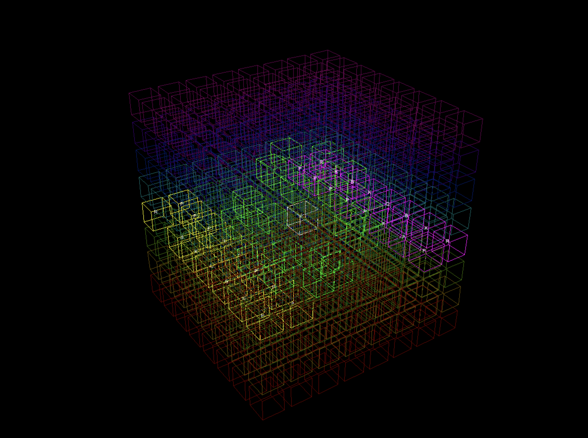

# Raumschach
a 3d chess game build in python with pygame



## Installation

```bash
  git clone repogit@github.com:falsanu/raumschach.git
  cd raumschach
  python3.12 -m venv venv
  source venv/bin/activate
  pip install -r ./requirements.txt
```

run raumschach with 
```bash
python3 raumschach.py
```


## Todo:

Choose wisely:
- [ ] make only possible clickable!
- [ ] create Teams
- [ ] hit opponents figures

## Done:

- [x] generate 3d projection
- [x] generate board
- [x] display possible fields
- [x] create figures 
  - [x] Pawn
  - [x] King
  - [x] Queen
  - [x] Bishop
  - [x] Knight
- [x] select single field
- [x] create inital setup
- [x] make moves
- [x] set Default screens
  

 ### Contribution
 very welcome!!!

### 
done @39C3 with Beer + Tschunk and [@jonaspews](https://github.com/jonaspews)

 ### LICENSE 
 MIT 2026